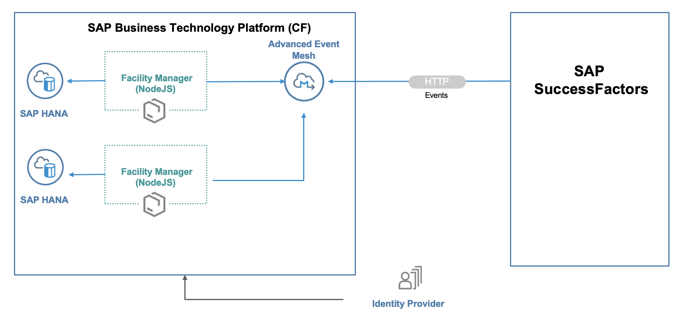

# SAP SuccessFactors Extension with SAP Integration Suite, Advanced Event Mesh

## Description

Extend SAP SuccessFactors on the SAP Business Technology Platform (SAP BTP) using state-of-the-art methodologies and technologies. Put an event-driven architecture into action, use the [**SAP Integration Suite, advanced event mesh**](https://help.sap.com/docs/SAP_ADVANCED_EVENT_MESH) for consuming on SAP SuccessFactors data events.

The main intent of this scenario is to complement an existing business process in an SAP solution, which means, enhancing SAP SuccessFactors with additional business process steps. This involves adding major logic and/or additional data and goes beyond simple UI changes.

## Business Scenario

John, Facility Manager of the ACME corporation would like to get a notification when an employee location is transferred by the company to his region (for example, Bribane, AUS). John would then proceed with the employee onboarding process by allocating their workstation and other relevant accessories (lockers, desk keys, and so on).

**Current Position - What is the challenge?**

- Employee data available only in SAP SuccessFactors system.
- Facility manager need access to SAP SuccessFactors for their work.
- No custom UI for specific workstation allocation use case.

**Destination - What is the outcome?**

- Changes in SAP SuccessFactors communicated via events in real time to extension application
- Custom extension application works independently from SAP SuccessFactors
- Facility Manager only needs access to the extension application

## Solution Architecture

The extension application is developed using the Express Node.js web application and runs on SAP BTP. It consumes platform services like SAP Integration Suite, advanced event mesh and SAP HANA services. The events generated in SAP SuccessFactors are inserted into an SAP Integration Suite, advanced event mesh queue created by a Node.js application (Facility Manager). The application consumes these events and inserts relevant employee details into the local database.

## Focus Topics

The tutorial focuses on the following aspects:

- Building a side-by-side extension to [SAP SuccessFactors](https://help.sap.com/docs/SAP_SUCCESSFACTORS_HXM_SUITE)
- Setting up eventing and consuming events from SAP SuccessFactors using [SAP Integration Suite, advanced event mesh](https://help.sap.com/docs/SAP_ADVANCED_EVENT_MESH)
- Developing an application on [SAP BTP](https://help.sap.com/viewer/product/BTP/Cloud/en-US?task=discover_task) 
- Implementing [SAP Fiori UI](https://help.sap.com/docs/SAPUI5)

## Where to Start ?

#### Step 1: [Prerequisites](./documentation/Prerequisites/README.md)

#### Step 2: [Set Up SAP Integration Suite, Advanced Event Mesh](./documentation/setup-advanced-event-mesh/README.md)

#### Step 3: [Set Up Events in SAP SuccessFactors](./documentation/setup-events-successfactors/README.md)

#### Step 4: [Set Up the Facility Manager Application](./documentation/setup-facility-manager-app/README.md)

#### Step 5: [Run the Sample Scenario](./documentation/execute-example-scenario/README.md)

## Known Issues

The tutorial is provided on the "as-is" basis.
- SAP Successfactors integration has restriction to use port number other than `443`. This requires configuration in the SAP Advanced Event Mesh administrator console to switch the `REST` port to `443`

## How to Obtain Support

Create an issue to get support or to report a bug in [GitHub](https://github.com/SAP-samples/issues).

## License

Copyright (c) 2023 SAP SE or an SAP affiliate company. All rights reserved. This project is licensed under the Apache Software License, version 2.0 except as noted otherwise in the [LICENSE](LICENSES/Apache-2.0.txt) file.

