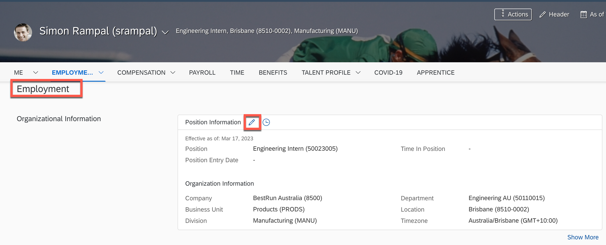
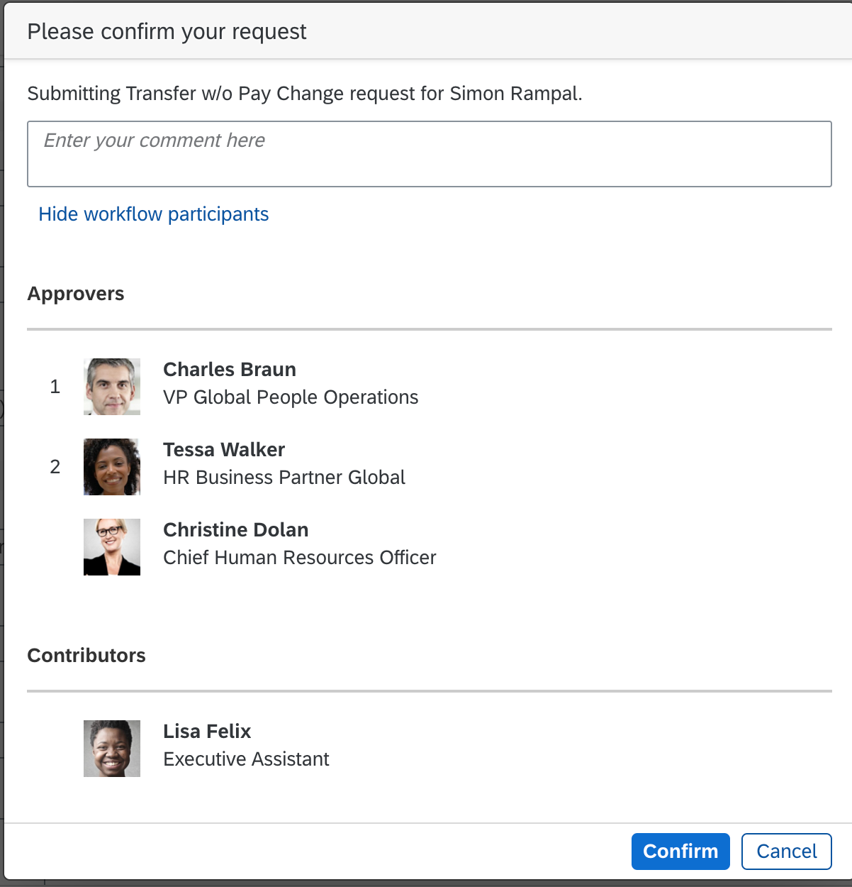
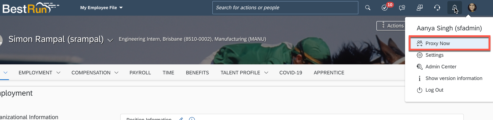
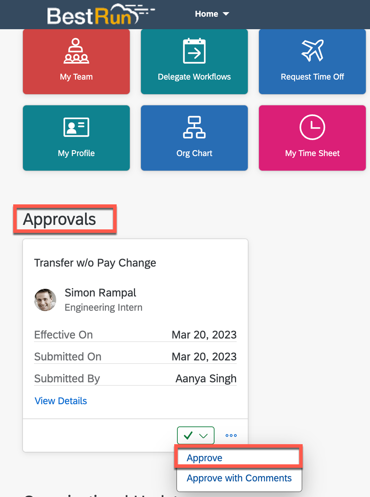
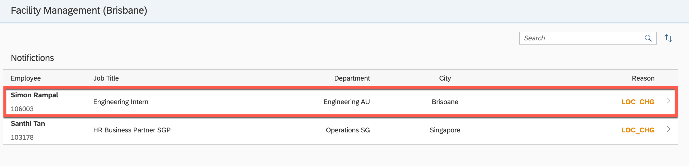
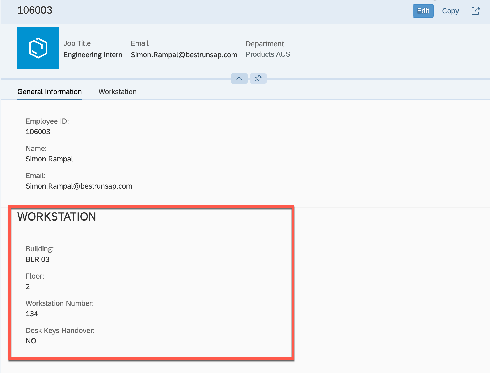

# Run the Sample Scenario

The scenario shows the transfer of employee to new location in the SAP SuccessFactors system.

## Change Location in SAP SuccessFactors

For an employee in SAP SuccessFactors system, let's change the location to (Brisbane, AUS), for example.

1. Log in to the SAP SuccessFactors demo instance with the SAP SuccessFactors Admin user, in this case the Admin user is **sfadmin**

2. Search for the employee **Simon Rampal** (srampal) in the Employee Directory.

3. Choose the employee **Simon Rampal**.

4. In the **Employment** section, edit **Position Information**.

    

5. Choose the today's date and change location to `Brisbane (8510-0002)`.

    

6. Choose **Save**.

7. In the next popup, you may check the workflow participants and confirm the action.

    

8. To trigger the Change event, two more Workflow participants has to approve this change. In our demo system, workflow participants are shown as 1. Charles Braun (VP Global People Operations); 2. Tessa Walker (HR Business Partner Global). This means that Charles Braun and Tessa Walker (or Christine Dolan) must approve this request to proceed.

9. You can log in/ask the workflow participants to approve the request. Choose **Proxy Now**, and then set Charles Braun (cbraun) in the **Select Target User** field to approve the request.

    

10. In the Home page of **Charles Braun**, approve the request for **Simon Rampal**.

    

11. Choose **Proxy Now**, and then set **Tessa Walker(twalker)** in the **Select Target User** to approve the request.

12. In the Home page of **Tessa Walker**, approve the request for **Simon Rampal**.

## Add Workstation in the Facility Manager Application

1. In the Cloud Foundry Command Line Interface, check if the application is running:

```
cf apps
```

2. Find the URL for the **FacilityAdmin-router** application - this is the launch URL for the Facility Manager application.

3. Open the URL in a browser.

4. Notice the notification for the employee **Simon Rampal**.

    

5. Go to the details page and maintain the workstation details.

    

6. Play around with the application.
