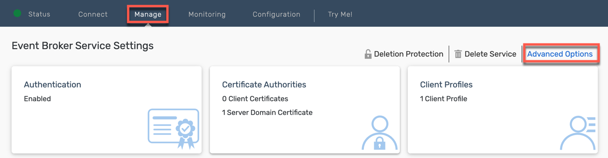
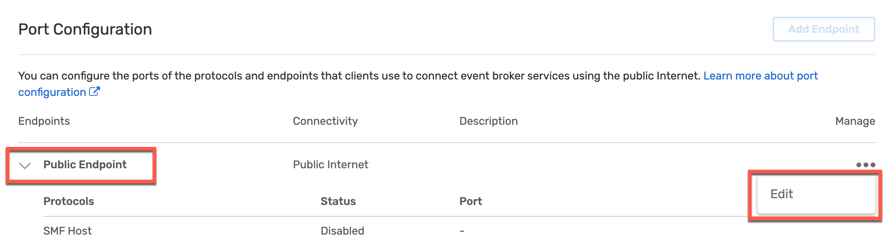
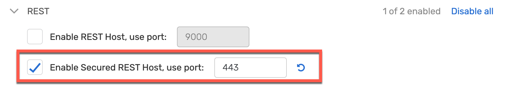

## Port Configuration in Advanced Event Mesh

The standard settings for SAP SuccessFactors ports don’t fit the standard settings for Advanced Event Mesh ports. So either we have to open up our AEM standard ports in SuccessFactors, or we can just adjust the ports on the Advanced Event Mesh side. Here we will just adjust the Advanced Event Mesh port settings since this is very straightforward.

1. Go to the **Cluster Manager** and select your Event Broker.

2. Click on **Manage** and choose **Advanced Options**.

3. Scroll down to **Port Configuration** section and expand **Public Endpoint**.

4. Click on **Edit**.

5. Swap the Port values of **Secured REST Host** and **Secured Web Messaging Host**

6. **Save** the changes.