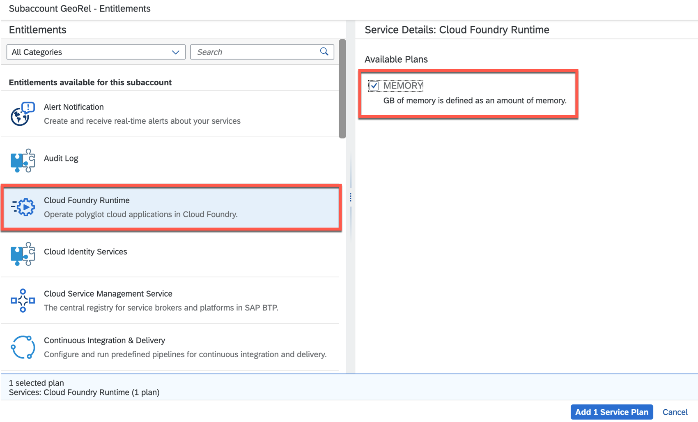
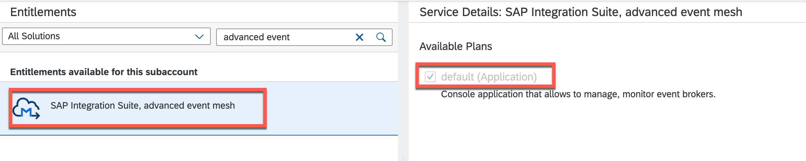
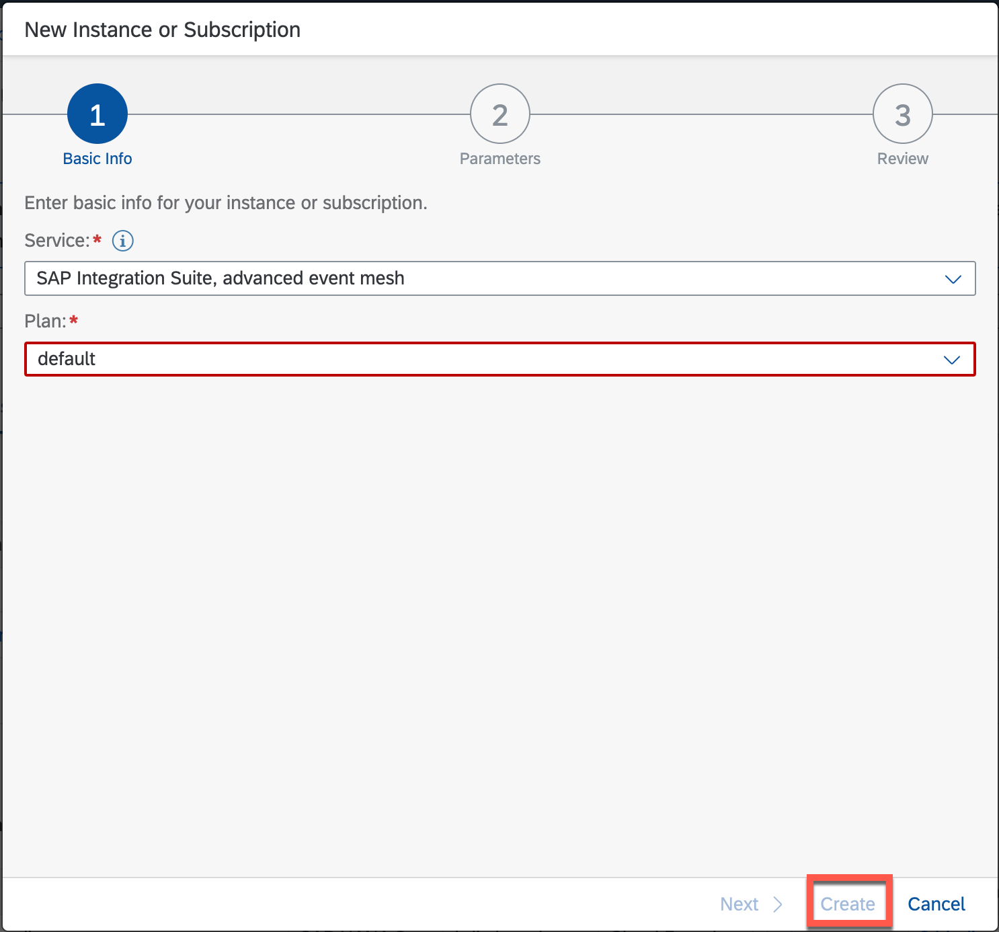
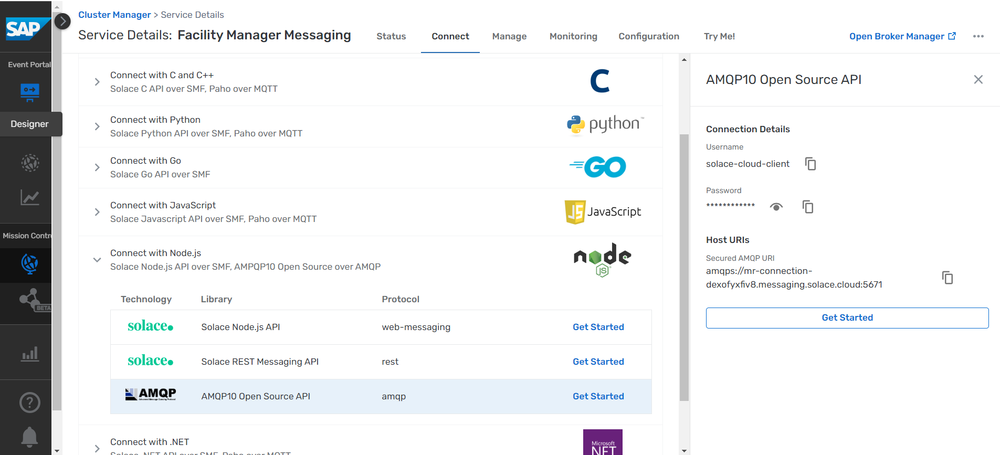
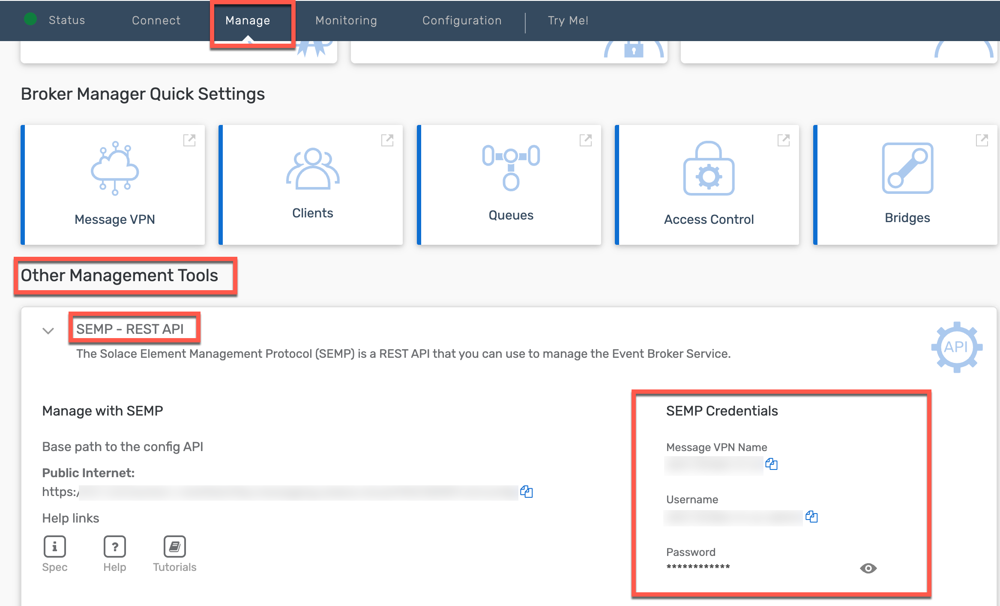
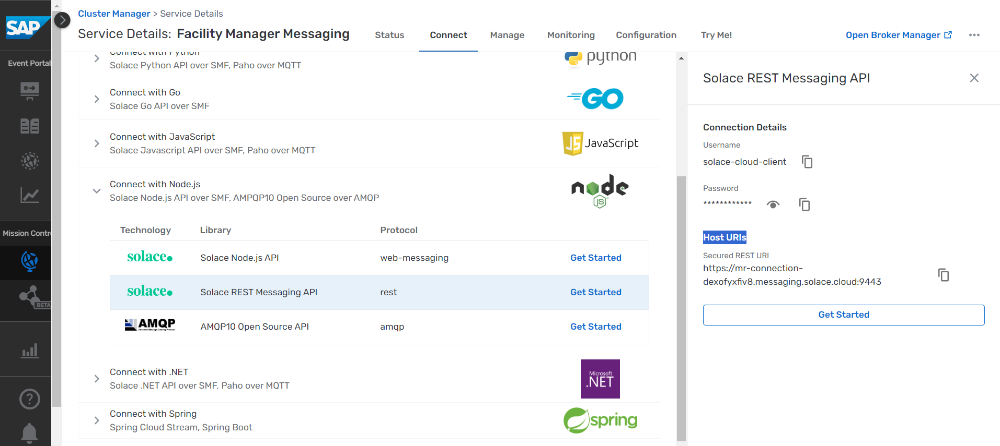

# Set Up SAP BTP and SAP Integration Suite, Advanced Event Mesh

## Configure Entitlements for SAP BTP, Cloud Foundry Runtime

> In case you do not have a subaccount in SAP BTP in place, see sections [Create a Subaccount](https://help.sap.com/viewer/65de2977205c403bbc107264b8eccf4b/Cloud/en-US/05280a123d3044ae97457a25b3013918.html?q=subaccount) and [Create Spaces](https://help.sap.com/viewer/65de2977205c403bbc107264b8eccf4b/Cloud/en-US/2f6ed22ccf424dae84345f4500c2d8ea.html) in the SAP BTP documentation for more details.

1. Make sure you are logged in to the SAP BTP cockpit as a Cloud Foundry administrator.

2. Choose **Entitlements** &rarr; **Entity Assignments**.

3. If there is no entry for the Cloud Foundry runtime, choose **Configure Entitlements**, and then **Add Service Plans**.

4. In the popup, proceed as follows:

- Choose **Cloud Foundry Runtime**.

- In the **Available Plans** section, select the **MEMORY** checkbox.

 

- Choose **Add 1 Service Plan**.

## Configure the Entitlement for SAP Integration Suite, Advanced Event Mesh

1. Choose **Configure Entitlements** &rarr; **Add Service Plan**.

2. In the **Subaccount Entitlements** dialog box, select the **SAP Integration Suite, advanced event mesh** service.

 

3. In the **Service Details: Advanced Event Mesh** screen area, select the **default** service plan.

4. Choose **Add 1 Service Plan** to add the SAP Integration Suite, advanced event mesh entitlement for your subaccount.

5. Choose **Save**.

## Subscribe to the SAP Integration Suite, Advanced Event Mesh Console

1. In the SAP BTP cockpit, navigate to your subaccount, and choose **Instances and Subscriptions**.

2. Choose **Create**.

3. In the **New Instance or Subscription** popup, select the following:
    - Service: **SAP Integration suite, Advanced event mesh**
    - Plan: **default**

    

4. Choose **Create**.

## Configure the Messaging Broker in the SAP Integration Suite, Advanced Event Mesh Console

1. In the SAP BTP cockpit, navigate to your subaccount, and choose **Instances and Subscriptions**.

2. Select the **Subscriptions** tab, and look for **SAP Integration suite, Advanced event mesh**. Choose the three dots ... to open the relevant **Actions**. Choose **Go to Application** to open the SAP Integration Suite, advanced event mesh console.

3. Enter your custom Identity Provider credentials to log in to the SAP Integration Suite, advanced event mesh console which opens in a separate browser tab.

4. Choose **Cluster Manager** from left pane and then choose **Create Service**.

5. Enter the following details:

    - Service Name: **Facility Manager Messaging**
    - Service Type: **Enterprise**
    - Cloud: Any Cloud Provider
    - Region: Choose suitable cloud region. For example, **EKS - Asia Pacific (Sydney)**.
    - Broker Version: Default

6. Choose **Create Service**.

7. Go to the **Connect** tab and copy the connection details from the **AMQP** API.

    

   > These details are to be filled in the **Set Up Facility Manager application**.

8. Go to the **Manage** tab and copy the credentials from the **SEMP REST API**.

     

    > These details are to be filled in the **Set Up Facility Manager application**.

9. Go back to the **Connect** tab and copy the credentals from the **REST API**.

    

    > These details are to be filled in the **Set Up Events in SAP SuccessFactors** [chapter](../setup-events-successfactors/README.md).
