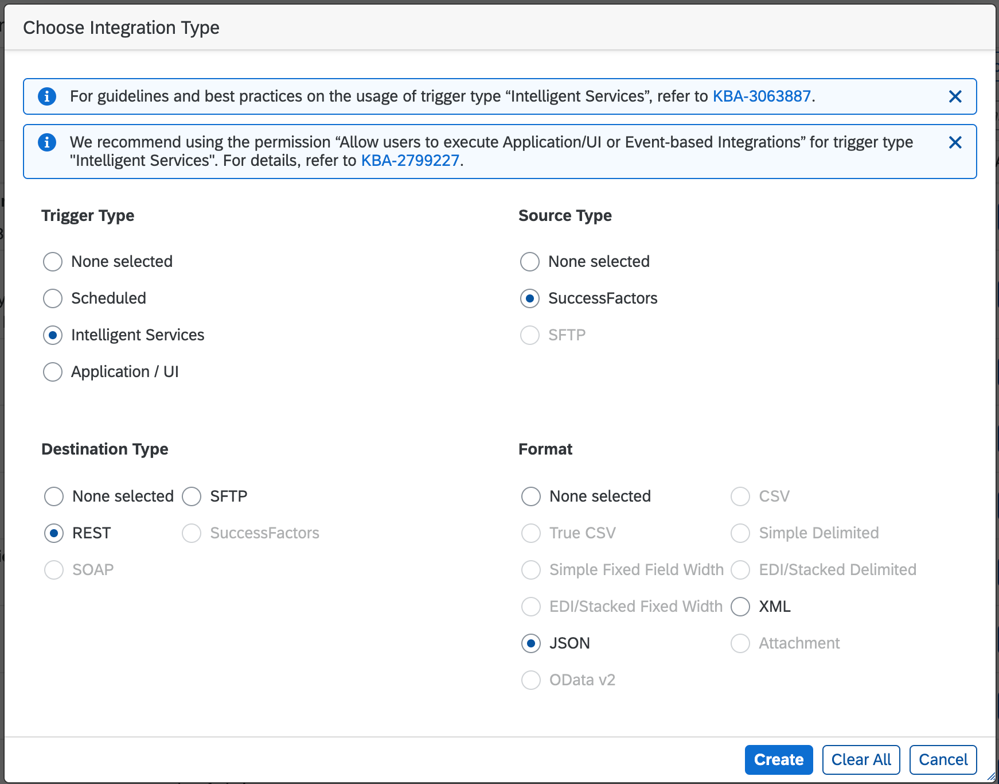
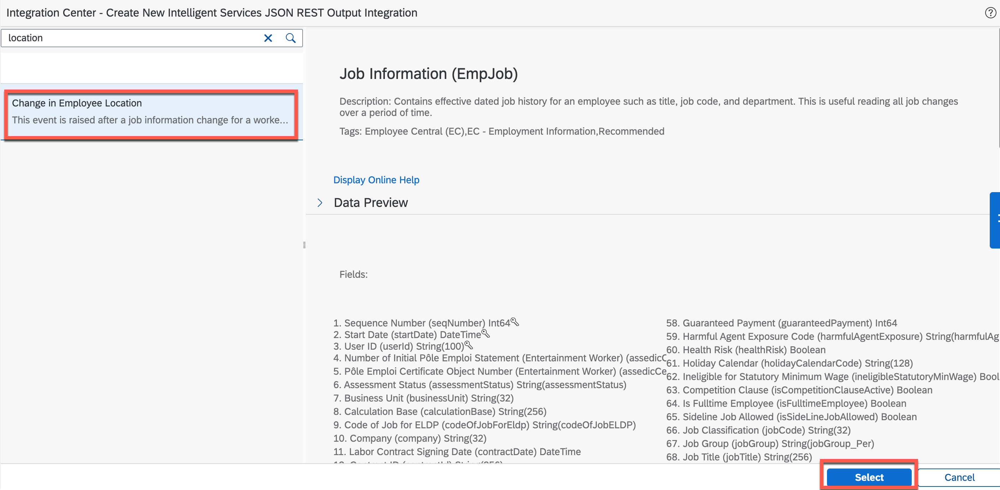
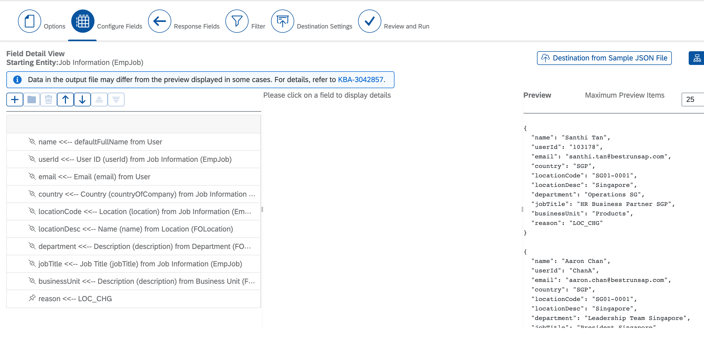
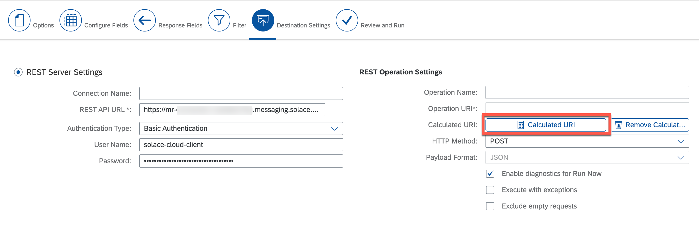
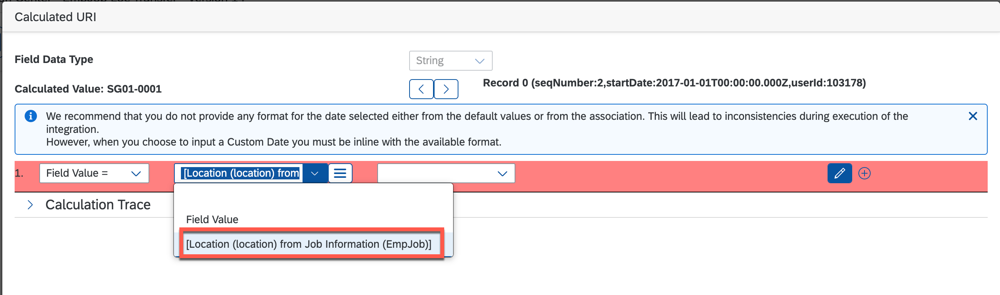
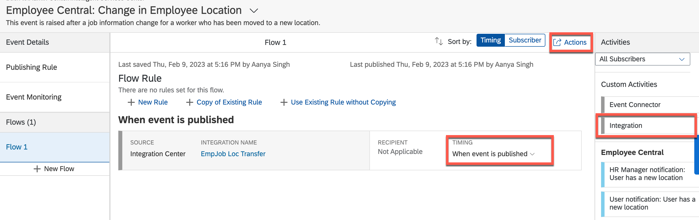

# Set Up Events in the SAP SuccessFactors System

### Create New Integration

1. Log in to your SAP SuccessFactors company with your username and password.

2. Go to **Integration Center** and select **My Integrations**.

3. Choose **+ Create** and select **More Integration Types**.

4. In the opened screen, select the following values:

- In the **Trigger Type** area, select the **Intelligent services** radio button.

- In the **Destination Type** area, select the **REST** radio button.

- In the **Source Type** area, select the **SuccessFactors** radio button.

- In the **Format Type** area, select the **JSON** radio button.

- Choose **Create**.

    

5. In the next screen, choose **Change in Employee Location**.

    

6. Enter a meaningful name in the **Integration Name** field, for example **Employee transfer - Brisbane**.

7. Choose **Next**.

8. Choose **+ button** to configure the fields and then choose **Insert sibling element**.

9. Enter the following elements as shown in the screenshot:

    

10. Choose one by one each of the elements created and in the detailed view of each element, choose the button with tooltip **Set as Association Field**, and map the respective fields:

    - name: defaultFullName from User
    - userId: User ID (userId) from Job Information (EmpJob)
    - email: Email (email) from User
    - country: Country (countryOfCompany) from Job Information
    - locationCode: Location (location) from Job Information
    - locationDesc: Name (name) from Location (FOLocation)
    - department: Description (description) from Department (departmentNav/description)
    - jobTitle: Job Title (jobTitle) from Job Information (EmpJob)
    - businessUnit: Description (description) from Business Unit (businessUnitNav/description)
    - reason: set default value **LOC_CHG**

11. Choose **Next** and go to **Destination Settings**.

12. In the REST server settings, enter the following details:

- REST API URL: Paste the public internet URL from connect REST API connection details from SAP Integration Suite, advanced event mesh and append suffix `/Topic/emp/transfer/`, for example `https://<>.solace.cloud:443/Topic/emp/transfer/`
- Authentication Type: Basic Authentication
- UserName: Paste the username from connect REST API connection details from SAP Integration Suite, advanced event mesh
- Password: Paste the password from connect REST API connection details from SAP Integration Suite, advanced event mesh

13. In the **Calculated URI** field, choose **Calculated URI**.

    

14. In the popup that appears, select the **Location (location) from Job Information (EmpJob)** field value.

    

15. Choose **OK** and then choose **Next**.

16. Save the integration.

### Set Up Intelligent Service

1. Search for **Intelligent Service Center (ISC)**.

2. Choose **Change in Employee Location**.

3. In the right side of the screen, choose **Custom Activities** &rarr; **Integration**.

    

4. There is a popup for selecting the integration. Choose the integration you just created and then choose **Add Integration**.

5. Scroll down to the list and select the integration you have created with the source **Integration Center**. Change the **Timing** to **When event is published**.

6. Choose **Actions**.

7. Choose **Save Flow**.
